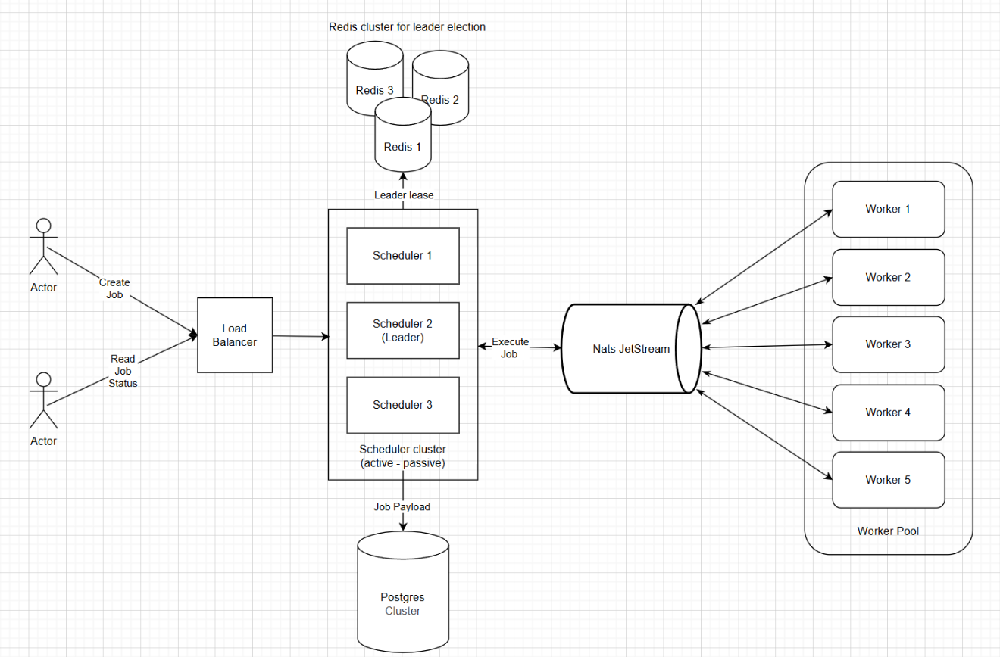

# Distributed-scheduler

# О проекте
Distributed Scheduler - это масштабируемая распределенная 
система для планирования и выполнения задач.
Система, поддерживает автоматическое масштабирование воркеров 
в зависимости от нагрузки.

# Логика работы
1. При помощи http сервера можно добавлять два типа задач
    * С интервалом
    * Одиночные (выполняются один раз в назначенное время).
2. Можно также
   * Просматривать информацию о конкретных задачах
   * Удалять
   * Просмотреть историю запусков на конкретных воркерах

Планировщики запускаются в нескольких инстансах (active - passive). 
Все инстансы могут добавлять новые задачи. 
Лидер также отвечает за планирование
задач (реализовано при помощи расределённой блокировки redsync).

Задачи отправляются в очередь NATS. В зависимости от количества 
задач меняется и количество воркеров. Проект можно запустить
при помощи docker compose и в Helm.

# Запуск Docker compose

```
make up
```

# Схема проекта


# Технологический стек
Golang, Postgres, Redis (Redsync), NATS JetStream, Nginx, Docker, k8s, Helm, Prometheus